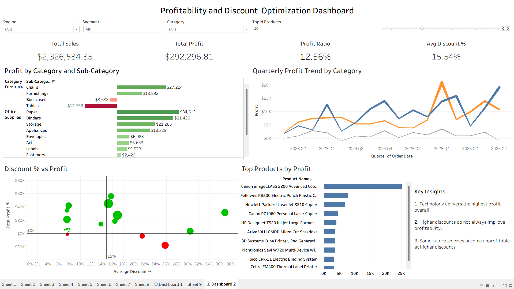

# Retail Profitability & Discount Optimization Dashboard | Tableau

## Dashboard Preview

## Project Overview
This project presents an interactive Tableau dashboard designed to analyze retail profitability, discount impact, category trends, and top-performing products. The dashboard helps identify profit-driving categories, discount-sensitive sub-categories, and products contributing most to overall profit.

## Key Metrics
- Total Sales
- Total Profit
- Profit Ratio
- Average Discount %

## Dashboard Features
- Interactive filters for Region, Segment, and Category
- Top N product analysis
- Profit by Category and Sub-Category
- Quarterly Profit Trend by Category
- Discount % vs Profit scatter plot
- Key business insights panel

## Insights
1. Technology delivers the highest profit overall.
2. Higher discounts do not always improve profitability.
3. Some sub-categories become unprofitable at higher discounts.

## Tools Used
- Tableau
- Data Visualization
- Dashboard Design

## Files Included
- Tableau packaged workbook (.twbx)
- Dashboard screenshot
- Sample dataset
- README documentation
